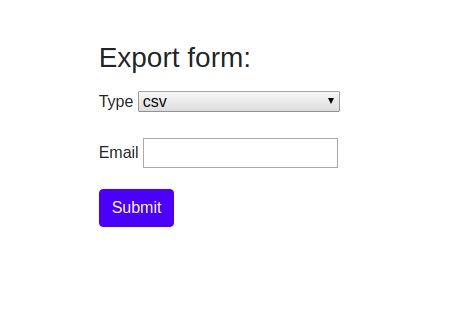

# Shortener PHP assessment
You are supposed to create a job export feature with different export engines and with rabbitmq support

### How app does look like


### Requirements of the assessment:
- Make MVP
- Design proper export algorithm

### Technologies used in the assessment
- Symfony 4.3
- Docker
- Docker Compose
- PHP 7.3.10
- PhpUnit 7.5.17
- Bash
- Git
- Bootstrap

### Prerequisites
Docker.io and docker-compose must be installed in the system in order to be able to use the app.
OS Linux

## How to setup the application:
```bash
git clone https://github.com/belushkin/export.git
cd export; ./toolbox.sh up
docker-compose exec web php bin/console doctrine:schema:create
docker-compose exec web php bin/console doctrine:migrations:migrate
docker-compose exec web php bin/console doctrine:fixtures:load
docker-compose exec web php bin/console messenger:consume
```

## How to run tests
```bash
./toolbox.sh tests
```

### URL of the running app
http://localhost:8000/

http://localhost:8080 (adminer)

- server: db-mysql
- username: root
- password: root
- db: app

http://0.0.0.0:8087/ (rabbitmq manager) (guest/guest)

## Basic script usage:
Application has **toolbox.sh** script. It is very easy run, stop, ssh, rebuild, run tests and stop the application.

```bash
./toolbox.sh up # run the application
./toolbox.sh rebuild # rebuild the image
./toolbox.sh ssh # ssh to the container
./toolbox.sh tests # run tests
./toolbox.sh down # stop the application
```

## Contributors
@belushkin

## License
MIT License
